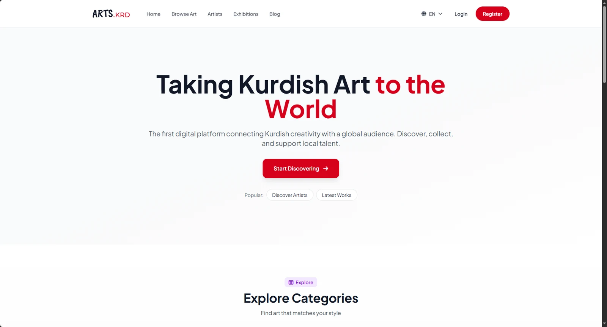
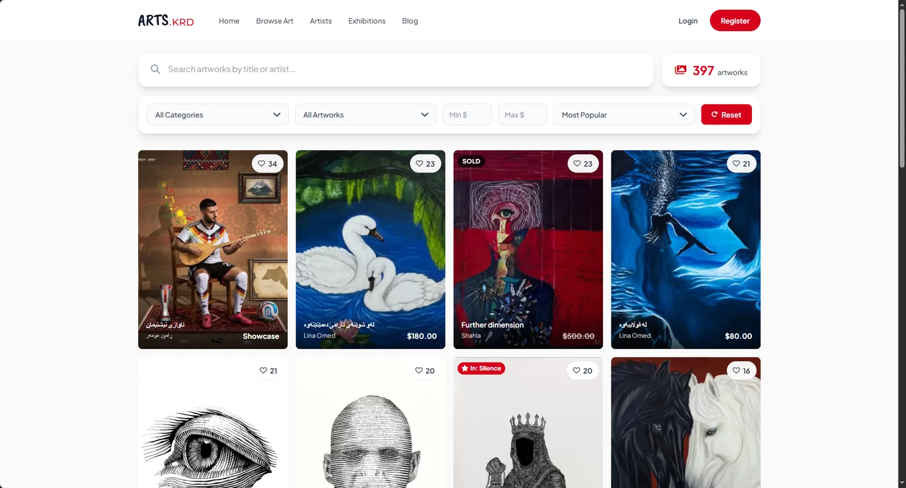
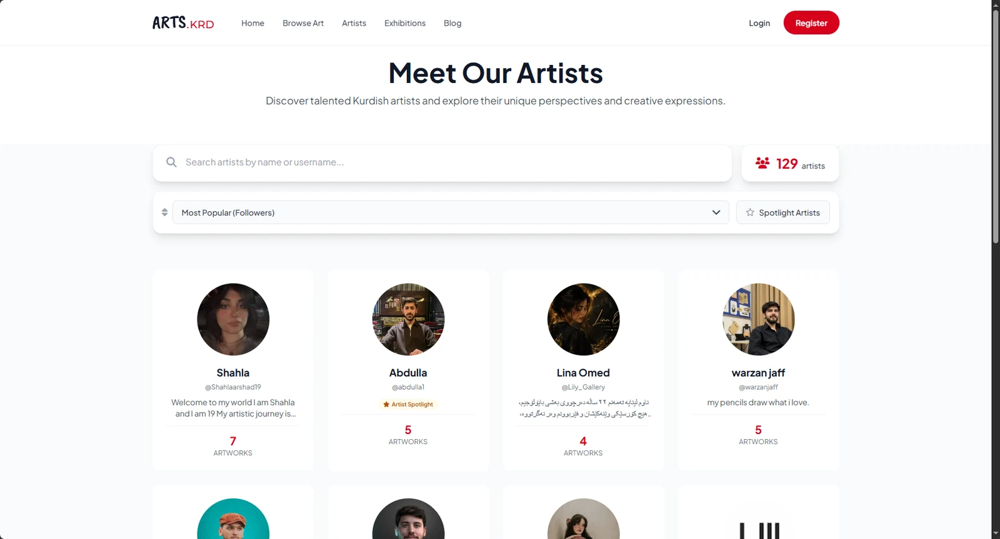
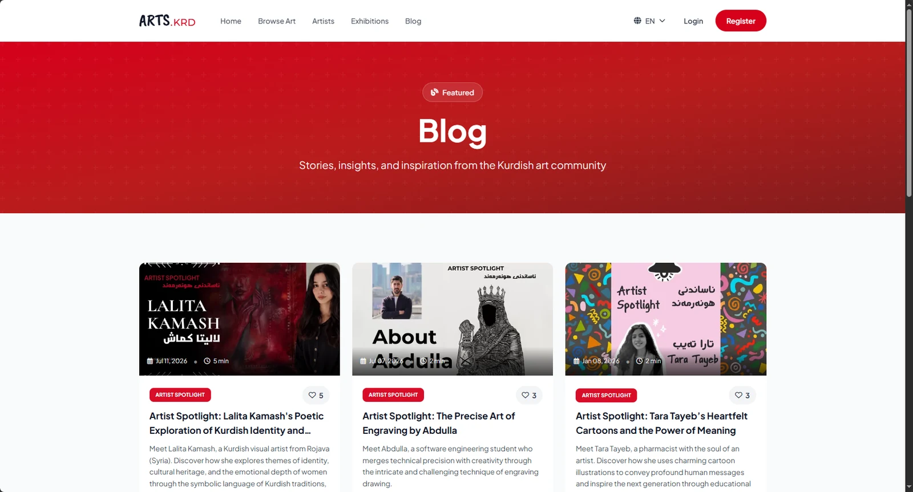
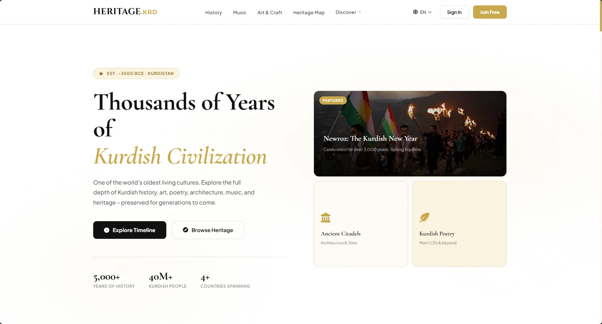
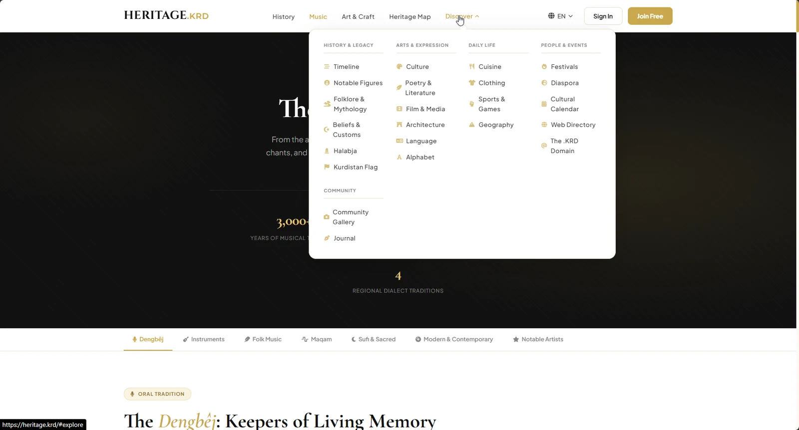
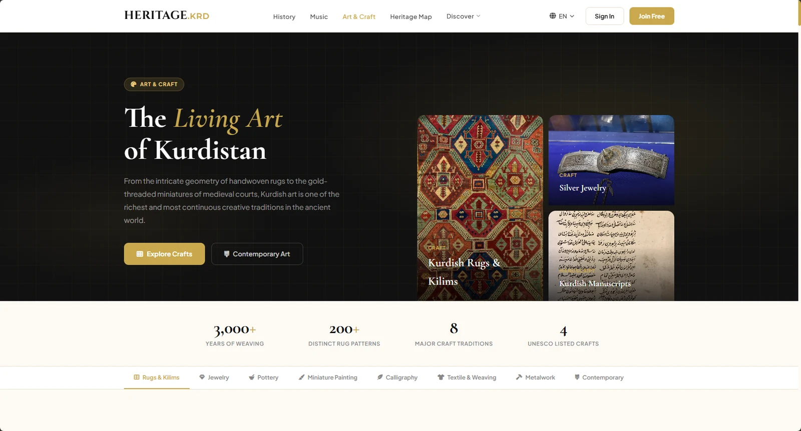
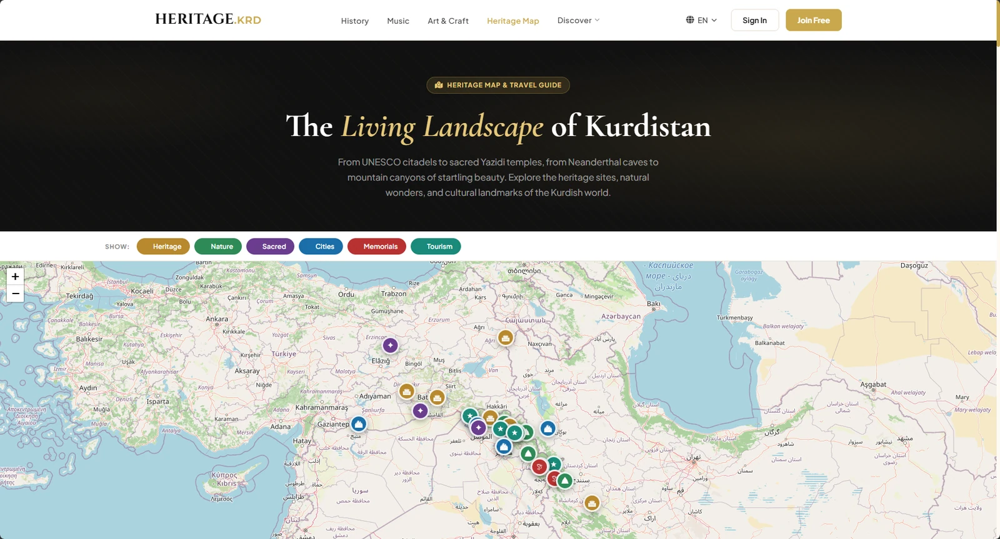
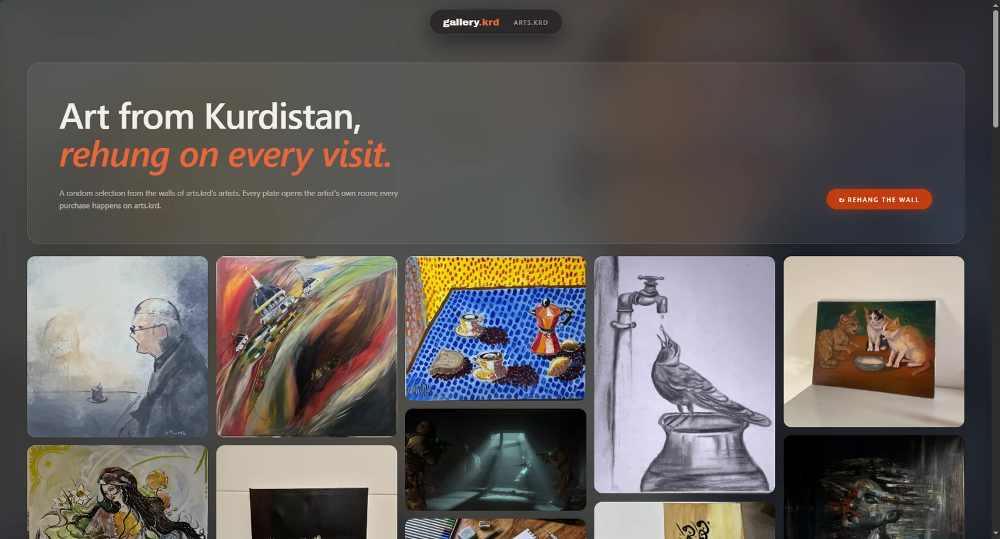
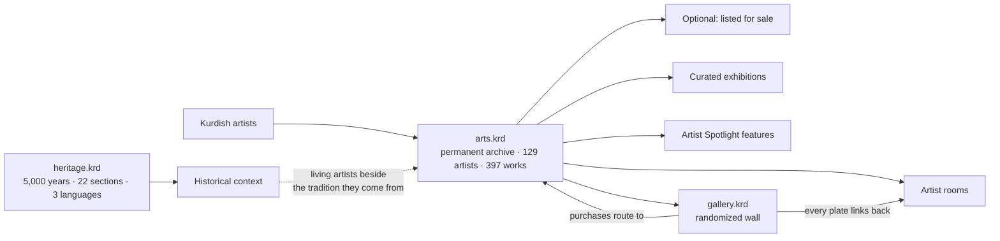

# .krd — Kurdish Cultural Platforms

**Three connected platforms giving Kurdish art and heritage a home on the web.**

A permanent home for Kurdish artwork, a record of 5,000 years of civilization,
and a gallery that re-hangs itself every time you visit.

[arts.krd](https://arts.krd) · [heritage.krd](https://heritage.krd) · [gallery.krd](https://gallery.krd) · [Veyoe](https://veyoe.com)

---

# [arts.krd](https://arts.krd)

**An archive first. A marketplace second.**

The first digital platform connecting Kurdish creativity with a global audience — built so that
a Kurdish artwork has somewhere permanent to exist.

`397 artworks` · `129 artists` · `100% of revenue to the artist`

<table>
<tr>
<td width="50%"></td>
<td width="50%"></td>
</tr>
<tr>
<td><b>Browse</b> — filter by category, artwork type and price range, sort by popularity. Pieces carry likes, prices in USD, and a <b>SOLD</b> state that stays visible rather than disappearing.</td>
<td><b>Artists</b> — every artist has a profile, a bio in their own language, a follower count and their own room. <b>Artist Spotlight</b> promotes selected artists.</td>
</tr>
</table>

### The work stays

Plenty of artists here aren't selling anything. They upload to **archive** — so the piece has a permanent address, a record of who made it and when, and somewhere it can be found years from now. Kurdish art has spent a long time scattered across private collections, Instagram posts and hard drives, and the losses are permanent when it goes.

So the platform is built archive-first. A piece uploaded stays up. It doesn't expire, it isn't delisted when interest fades, and nothing requires an artist to put a price on it. Selling is a second, optional step — a switch you flip if you want to, not the point of being here.

That's also why **sold work stays visible**, with its price struck through rather than the page disappearing. On a marketplace a sold listing is finished business. In an archive it's a record: this existed, this person made it, someone valued it at this.

### 100% to the artist

When a piece does sell, every cent goes to the artist. The platform takes nothing. That follows from the same decision — this is infrastructure for a body of work, not a business built on a cut of it, and it's the reason artists trust it enough to upload in the first place.

### Artists, not just artwork

The blog runs **Artist Spotlight** features: long-form pieces on individual artists in English and Kurdish, with reading times and their own artwork as cover images. A pharmacist who draws cartoons, a software engineering student who does engraving, a visual artist from Rojava working on Kurdish identity.

An archive that only stores files loses the half that matters. Who made this, where they're from, what they were working through — that context is the difference between a preserved artwork and a preserved JPEG.

**Exhibitions** are curated online shows: a themed collection with its own identity, running for a period and then archived. *Silence — بێدەنگی — what goes unspoken* ran in August 2026, and pieces that were in it still carry the exhibition badge when you find them in the catalogue.

---

# [heritage.krd](https://heritage.krd)

**A trilingual archive of one of the world's oldest living cultures.**

`5,000+ years of history` · `40M+ Kurdish people` · `4+ countries`

### The scale of it

This is the whole archive in one menu — and the reason the project is harder than it looks:

| | |
|---|---|
| **History & Legacy** | Timeline · Notable Figures · Folklore & Mythology · Beliefs & Customs · Halabja · The Kurdistan Flag |
| **Arts & Expression** | Culture · Poetry & Literature · Film & Media · Architecture · Language · Alphabet |
| **Daily Life** | Cuisine · Clothing · Sports & Games · Geography |
| **People & Events** | Festivals · Diaspora · Cultural Calendar · Web Directory · The .KRD Domain |
| **Community** | Community Gallery · Journal |

Every one of those is a section with its own structure, its own content model and its own three language versions. **Music** alone breaks into Dengbêj, instruments, folk, maqam, Sufi and sacred, modern, and notable artists — covering 3,000+ years of musical tradition across 4 regional dialect traditions.

### Depth, not a summary

`3,000+ years of weaving` · `200+ distinct rug patterns` · `8 major craft traditions` · `4 UNESCO-listed crafts`

Art & Craft alone divides into rugs and kilims, jewellery, pottery, miniature painting, calligraphy, textile and weaving, metalwork, and contemporary — each with its own material. The archive is built to reward someone who goes deep, not just someone who skims a summary page.

### A culture that crosses four borders

The **Heritage Map** plots UNESCO citadels, sacred Yazidi temples, Neanderthal caves, mountain canyons, cities and memorials — filterable by Heritage, Nature, Sacred, Cities, Memorials and Tourism.

It's also the clearest statement the archive makes. Kurdish heritage doesn't sit inside one country's borders, and a map is the only honest way to show that.

---

# [gallery.krd](https://gallery.krd)

**Art from Kurdistan, re-hung on every visit.**

A random selection from the walls of arts.krd's artists, rearranged every time the page loads. Every plate opens the artist's own room; every purchase happens back on arts.krd.

It exists because an archive and a gallery want opposite things. An archive is sorted, filtered and searchable — which means the same popular work surfaces every time and an artist who joined last week stays invisible. A gallery just puts things on a wall. **Re-hang the wall** gives every artist the same chance of being the first thing you see.

---

## How the three fit together

One network, three entry points: **arts.krd** is where work is preserved — and sold, if the artist wants — **gallery.krd** is where it's discovered, **heritage.krd** is the context it sits in.

---

## Notes on building these

**Trilingual is an architecture decision, not a feature.** Kurdish, English and Arabic on the same platform means mixed scripts and mixed text direction, with Kurdish content sitting inside an English layout and vice versa. That can't be retrofitted onto a finished site — it shapes the content model, the routing and the layout system from the first commit. Artist bios on arts.krd appear in whichever language the artist wrote them, in the middle of an English page, and still have to look right.

**Naming is content.** *Dengbêj*, *Maqam*, *Newroz*, *Mem û Zîn*, *بێدەنگی* — the archive uses the real terms with their own diacritics and scripts rather than flattening them into English approximations. That's a small technical burden and the entire point of the project.

**Nothing is built to expire.** No listing timeouts, no archived-after-N-days, no delisting when a piece sells. Every design decision that would normally optimise a marketplace for turnover was decided the other way, because the artwork outlasting the transaction is the entire proposition.

**The three sites share data deliberately.** gallery.krd draws live from arts.krd's catalogue; heritage.krd's community gallery connects contemporary work to the tradition around it.

---

## Stack

`PHP` · `MySQL` · `JavaScript` · `HTML` · `CSS`

All three platforms are built on the same stack — no framework, no build step. The multilingual content architecture, the heritage map, the randomized gallery wall and the artist rooms are all plain PHP against MySQL.

---

## Repository status

This is a **showcase repository**. All three platforms are live, hold real artists' work, and handle real transactions, so their source is private. This page documents what they are and how they fit together.

Visit them: **[arts.krd](https://arts.krd)** · **[heritage.krd](https://heritage.krd)** · **[gallery.krd](https://gallery.krd)**

---

**Built by [Zanyar Abdulbast](https://github.com/zanyarrrrrr)**
Design, engineering, brand identity and content architecture
Erbil, Kurdistan Region of Iraq

